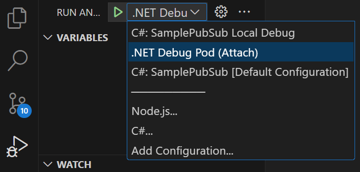
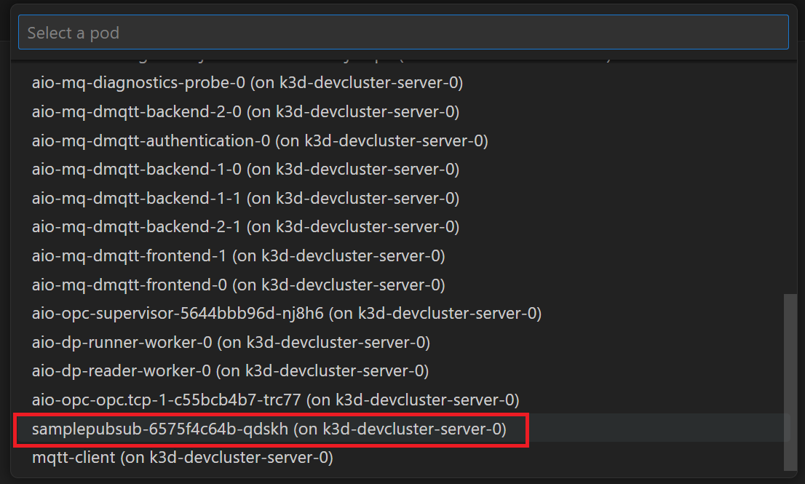

# Azure IoT Operations Inner Developer Loop - Sample with Dapr

> Note: [Azure IoT Operations](https://learn.microsoft.com/en-us/azure/iot-operations/) is currently in PREVIEW and subject to change. This sample might stop working at any time due to changes in the PREVIEW.

Inner developer loop with Visual Studio Code, Dev Container and VS Code Kubernetes Tools to allow local developer environment configuration and debugging of workloads.
The sample workload is using .NET, though the same debugging experience can be achieved with other languages.

## Prerequisites

- Visual Studio Code
- Docker
- Dev container support
- Azure subscription

## Initial Setup

Open this project in Visual Studio Code dev container:

- Open the Command palette
- Choose the option `Dev Containers: Reopen in container`
- Once the image has been initialized, the dev container will have initialized K3D Kubernetes cluster with a local container registry for development purposes. This is now ready for initializing Azure IoT Operations and Azure Arc. The container registry is available inside the devcontainer and inside the K3D cluster under the name `k3d-devregistry.localhost:5500`.

### Connect to Azure Arc

Run all these scripts from your PowerShell terminal.

Ensure you are logged into your Azure tenant and set a default subscription.

```powershell
 
az login # optionally add --tenant "<tenant_id>"
az account set --subscription "mysubscription_name_or_id"
az account show

```

Run the following script to connect the K3D Kubernetes cluster to Azure Arc, and enter your choice of cluster name, resource group and location. Ensure that for the parameter `Location` you use one of the [supported regions](https://learn.microsoft.com/en-us/azure/iot-operations/get-started/quickstart-deploy?tabs=linux).

```powershell
 
 ./devsetup/1-arc.ps1 -ClusterName arck-MY-CLUSTER -ResourceGroupName rg-MY-RG -Location northeurope

```

### Deploy Azure IoT Operations

Run the following script to provision an Azure Key Vault and deploy full AIO with the default settings,  including an MQ non-TLS listener and a Simulated PLC.

Please be patient as this deployment will take more than **15 minutes**.

```powershell
 
 ./devsetup/2-aio-full-cli.ps1 -ClusterName arck-MY-CLUSTER -ResourceGroupName rg-MY-RG -KeyVaultName kv-MY-KEYVAULTNAME

```

This is a one-time setup and you are now ready to develop your custom modules and debug them on the cluster using VS Code Kubernetes Tools.

## Debugging C# Sample PubSub with Dapr Pluggable Component to AIO MQTT

The sample application found under `/src/csharp/SamplePubSub/` is a .NET application that leverages Dapr for PubSub with AIO's MQ service to subscribe and publish messages. You can debug this application within the  environment by leveraging [VS Code Kubernetes Tools - Debugging](https://github.com/vscode-kubernetes-tools/vscode-kubernetes-tools/blob/master/debug-on-kubernetes.md), which is already pre-installed and configured within the Dev Container.

The Dockerfile used to build the container image for the pod is configured to include the required [debugging tools](https://github.com/vscode-kubernetes-tools/vscode-kubernetes-tools/blob/master/debug-on-kubernetes.md#6-dotnet-debugging). The `dev.Dockerfile` for development and debugging purposes can be reviewed here: [dev.Dockerfile](./src/csharp/SamplePubSub/dev.Dockerfile).

For production you would not use this version of the Dockerfile, as it includes debug tools installed on the container. There is a sample production Dockerfile [here](./src/csharp/SamplePubSub/Dockerfile).

### Building, deploying and debugging the application

Several scripts allow you to automate the process, all of which can be found in the folder `./src/csharp/deploydebug`.

1. First start by reviewing the code in the project under `./src/csharp/SamplePubSub/`.
2. Review the YAML which deploys the Dapr component, the sample application and a Service: [`.src/csharp/deploydebug/yaml/samplepubsub.yaml`](src/csharp/deploydebug/yaml/samplepubsub.yaml). Review the 
3. Build the docker container for the application:
    - Open a new terminal Window with PowerShell if not yet open.
    - Run the following to build the docker image and push it to the local Docker registry in the K3D cluster: ` ./src/csharp/deploydebug/build.ps1 -Version 0.1 `. For the parameter `Version` you can use what you like, and normally increase the version with every build.
    - Deploy the Pod, Component and Service to the cluster by running `./src/csharp/deploydebug/deploy.ps1 -Version 0.1`. Note that the `Version` matches an existing image tag that you have built before. The deployment will use the namespace `azure-iot-operations` by default as this is currently ensuring the application is in the same namespace as AIO components.
    - Validate the deployment is running:
        ```bash
        kubectl get pod,svc | grep samplepubsub

        pod/samplepubsub-7b9745799c-55hw4              3/3     Running   0             16m
        service/samplepubsub-dapr                      ClusterIP   None            <none>        80/TCP,50001/TCP,50002/TCP,9090/TCP             2d17h
        service/samplepubsub-svc                       ClusterIP   10.43.76.40     <none>        5111/TCP             2d17h
        ```
4. Now that the application is running you can debug it by using the Debug Launcher. The configuration is already done and can be reviewed in `.vscode/settings.json` and `.vscode/launch.json` files.
5. Ensure the Default Namespace in Kubernetes cluster is set to `azure-iot-operations`.
6. Choose the Run and Debug icon in the VS Code left bar, and pick **.NET Debug Pod (Attach)**
 
7. Start debugging (F5).
8. The Pod Selector will pop up. Select the pod `samplepubusub-xxx`. 

### Debugging Flow with AIO MQTT Broker Messages

1. Ensure debug session is still active. Add a new breakpoint in the file `src/csharp/SamplePubSub/Controllers/MessagesTransformerController.cs`, under the function `MessageReceived` so you can debug messages coming in.
1. Start a new terminal window using bash or PowerShell as preferred.
1. Run MQTTUI to view messages on the MQ: `mqttui`. This command will connect to the default MQTT server at `localhost` port `1883` which is being forwarded from the cluster to your Dev Container. Leave this terminal window running.
1. Open yet another Terminal window.
1. Publish a message to the MQ (in the second terminal): `mqttui publish "messages" '{"content":"Hello world","tag":"this is 1"}'`.
1. You should now enter debug console and you can debug as desired based on breakpoints in your code.
1. After debugging through the function, go back to your Terminal window where `mqttui` is running and you should see the original message as well as a copy of the message under the topic `outmessages`.
1. Stop debugging when done (Shift + F5).

### Update Application and Deploy New Version to Debug

Anytime you are doing code changes you can repeat the process to build and deploy a new version of the code and pod to debug again. The version of the deployed container needs to match the source code on your machine.

To do this, you will can iteratively build a new version and deploy it using the convenience scripts.

1. Build the new version ` ./src/csharp/deploydebug/build.ps1 -Version 0.2 `.
1. Deploy the new version ` ./src/csharp/deploydebug/deploy.ps1 -Version 0.2 `.
1. By applying a new docker image reference in the YAML file, the old version of the pod will be terminated and a new version runs.
1. From here you can debug again as before, now debugging new code.

To remove the pod deployment completely from the Kubernetes cluster you can run the clean-up script.

```powershell
./src/csharp/deploydebug/cleanup.ps1 -Version 0.1
```

## Clean-up Environment and Reset Dev Container

Whenever you want to start again with a new K3D registry, cluster, Azure Arc and AIO components in both Azure and local cluster, you can run the PowerShell script `devsetup/0-cleanup.ps1`.

```powershell
./devsetup/0-cleanup.ps1 -ResourceGroupName rg-MY-RG
```

This deletes all Azure resources (resource group, Azure Arc, Key Vault). It also deletes the K3D container registry and cluster, and then re-creates the registry and K3D cluster once again.

## Additional Deployment Samples

This repo also contains a few options to deploy AIO components in a more customized way, leveraging `CustomResouceDefinition` (CRD) based resources and Helm charts. You can review a few samples for development purposes shared in the document [AIO - Deployment Options in Developer Environment](./devsetup/readme.md).

## Option to Leverage this Sample without Dev Container

It should also be possible to run a local debug loop without the Visual Studio Dev Container, however this has not been validated. You will need to ensure the following extensions and features are installed in Visual Studio Code, in addition to the pre-requisites mentioned earlier:

- [Visual Studio Code Kubernetes Tools](https://github.com/vscode-kubernetes-tools/vscode-kubernetes-tools/tree/master)
- [C# Dev Kit](https://marketplace.visualstudio.com/items?itemName=ms-dotnettools.csdevkit)
- Azure CLI
- [PowerShell](https://learn.microsoft.com/en-us/powershell/scripting/install/installing-powershell?view=powershell-7.4)
- .NET SDK

For the Kubernetes cluster and Azure IoT Operations, the key thing to ensure is that you have access to a Kubernetes cluster and set it in your KUBECONIG. Additionally to run AIO on the cluster you need to review the pre-requisites here: [Prepare a cluster](https://learn.microsoft.com/en-us/azure/iot-operations/deploy-iot-ops/howto-prepare-cluster?tabs=aks-edge-essentials).
