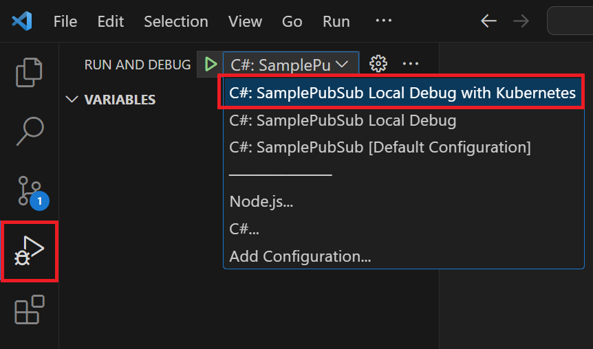

# Azure IoT Operations Inner Developer Loop - Sample with Dapr

> Note: [Azure IoT Operations](https://learn.microsoft.com/en-us/azure/iot-operations/) is currently in PREVIEW and subject to change. This sample might stop working at any time due to changes in the PREVIEW.

Inner dev loop with Visual Studio Code, dev container and Bridge to Kubernetes to allow local developer environment configuration and debugging of workloads.
The sample workload is using .NET, though the same debugging experience can be achieved with other languages.

## Prerequisites

- Visual Studio Code
- Docker
- Dev container support
- Azure subscription

## Initial Setup

Open this project in Visual Studio Code dev container:

- Open the Command palette
- Choose the option `Dev Containers: Reopen in container`
- Once the image has been initialized, the dev container will have initialized K3D Kubernetes cluster with a local container registry for development purposes. This is now ready for initializing Azure IoT Operations and Azure Arc. The container registry is available inside the devcontainer and inside the K3D cluster under the name `k3d-devregistry.localhost:5500`.

### Connect to Azure Arc

Run all these scripts from your PowerShell terminal.

Ensure you are logged into your Azure tenant and set a default subscription.

```powershell
 
az login # optionally add --tenant "tenantid"
az account set --subscription "mysubscription_name_or_id"
az account show

```

Run the following script remembering to take note of the parameters passed. Ensure that for the parameter `Location` you use one of the [supported regions](https://learn.microsoft.com/en-us/azure/iot-operations/get-started/quickstart-deploy?tabs=linux).

```powershell
 
 ./devsetup/1-arc.ps1 -ClusterName arck-MY-CLUSTER -ResourceGroupName rg-MY-RG -Location northeurope

```

### Deploy Azure IoT Operations

Run the following script to provision an Azure Key Vault and deploy full AIO with the default settings,  including an MQ non-TLS listener and a Simulated PLC.

Please be patient as this deployment will take more than **15 minutes**.

```powershell
 
 ./devsetup/2-aio-full-cli.ps1 -ClusterName arck-MY-CLUSTER -ResourceGroupName rg-MY-RG -KeyVaultName kv-MY-KEYVAULTNAME

```

This is a one-time setup and you are now ready to develop your custom modules and debug them on the cluster using Bridge for Kubernetes.

## Debugging C# Sample PubSub with Bridge to Kubernetes

The sample application found under `/src/csharp/SamplePubSub/` is a .NET application that leverages Dapr for PubSub with AIO's MQ service to subscribe and publish messages. You can debug this in your environment by leveraging [Bridge to Kubernetes]() feature that is already pre-installed within the Dev Container.

### Building, deploying and debugging the application

Several scripts allow you to automate the process, all of which can be found in the folder `src/csharp/deploydebug`.

1. First start by reviewing the code in the project under `/src/csharp/SamplePubSub/`.
2. Review the YAML which deploys the Dapr component, the sample application and a Service: [`src/csharp/deploydebug/yaml/samplepubsub.yaml`](src/csharp/deploydebug/yaml/samplepubsub.yaml).
3. Build the docker container for the application:
    - Open a new terminal Window with PowerShell if not yet open.
    - Run the following to build the docker image and push it to the local Docker registry in the K3D cluster: ` ./src/csharp/deploydebug/build.ps1 -Version 0.1 `. For the parameter `Version` you can use what you like, and normally increase the version with every build.
    - Deploy the Pod, Component and Service to the cluster by running `./src/csharp/deploydebug/deploy.ps1 -Version 0.1`. Note that the `Version` matches an existing image tag that you have built before. The deployment will use the namespace `azure-iot-operations` by default as this is currently ensuring the application is in the same namespace as AIO components.
    - Validate the deployment is running:
        ```bash
        kubectl get pod,svc | grep samplepubsub

        pod/samplepubsub-7b9745799c-55hw4              3/3     Running   0             16m
        service/samplepubsub-dapr                      ClusterIP   None            <none>        80/TCP,50001/TCP,50002/TCP,9090/TCP             2d17h
        service/samplepubsub-svc                       ClusterIP   10.43.76.40     <none>        5111/TCP             2d17h
        ```
4. Now that the application is running you can debug with Bridge to Kubernetes. The configuration is already done and can be reviewed in `.vscode/tasks.json` and `.vscode/launch.json` files.
5. Ensure the Default Namespace in Kubernetes cluster is set to `azure-iot-operations`.
6. Choose the Run and Debug icon in the VS Code left bar 
7. Start debugging (F5). Bridge to Kubernetes will start up and forward traffic from the cluster to your local debug session.

### Debugging Flow with AIO MQTT Broker Messages

1. Ensure debug session is still active. Add a new breakpoint in the file `src/csharp/SamplePubSub/Controllers/MessagesTransformerController.cs`, under the function `MessageReceived` so you can debug messages coming in.
1. Start a new terminal window using bash or PowerShell as preferred.
1. Run MQTTUI to view messages on the MQ: `mqttui`. This command will connect to the default MQTT server at `localhost` port `1883` which is being forwarded from the cluster to your Dev Container. Leave this terminal window running. If you need to manually forward the traffic run the following in yet another terminal: `kubectl port-forward svc/aio-mq-dmqtt-frontend 1883:1883`. Leave this one running.
1. Open yet another Terminal window.
1. Publish a message to the MQ: `mqttui publish "messages" '{"content":"Hello world","tag":"this is 1"}'`.
1. You should now enter debug console and you can debug as desired based on breakpoints in your code.
1. After debugging through the function, go back to your Terminal window where `mqttui` is running and you should see the original message as well as a copy of the message under the topic `outmessages`.
1. Stop debugging and Bridge to Kubernetes will reset the environment so that your application is again running in the cluster.

### Update Application and Deploy New Version to Debug

When you want to do code changes, chances are you don't need to build and deploy a new version of the container to debug. Simply stop debugging session, do your code changes and start debugging session again as described above. Because the traffic is redirected to your own code on the machine, new code changes should be reflected and you can increase your developer speed. This works regardless of the actual version of the container deployed to the cluster.

There might however be cases when you do need to deploy new Pod configuration and new code changes to the cluster, and then debug from again with changes reflected. For this, you can use the script `src/csharp/deploydebug/cleanup.ps1` to remove the deployment from the cluster.

```powershell
./src/csharp/deploydebug/cleanup.ps1 -Version 0.1
```

After the application has been removed from the cluster simply rerun the scripts to build the Docker images and deploy to the cluster as described in the section Building, deploying and debugging the application above, and increase the `Version` parameter.

## Clean-up environment and Reset Dev Container

Whenever you want to start again with a new K3D registry, cluster, Azure Arc and AIO components in both Azure and local cluster, you can run the PowerShell script `devsetup/0-cleanup.ps1`.

```powershell
./devsetup/0-cleanup.ps1 -ResourceGroupName rg-MY-RG
```

This deletes all Azure resources (resource group, Azure Arc, Key Vault). It also deletes the K3D container registry and cluster, and then re-creates the registry and K3D cluster once again.

## Option to Leverage this Sample without Dev Container

It is also possible to run a local debug loop without the Visual Studio Dev Container, however this is not yet documented. The pre-requisites and setup will be explained at a later stage.
